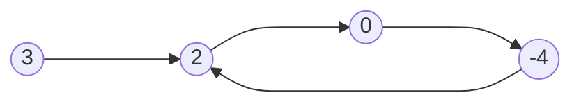
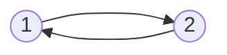


Difficulty: 


## Problem Description

### English (Linked List Cycle)

Given `head`, the head of a linked list, determine if the linked list has a cycle in it.

There is a cycle in a linked list if there is some node in the list that can be reached again by continuously following the `next` pointer. Internally, `pos` is used to denote the index of the node that tail's `next` pointer is connected to. **Note that `pos` is not passed as a parameter.**

Return `true` *if there is a cycle in the linked list*. Otherwise, return `false`.

**Example 1:**



```log
Input: head = [3,2,0,-4], pos = 1
Output: true
Explanation: There is a cycle in the linked list, where the tail connects to the 1st node (0-indexed).
```

**Example 2:**



```log
Input: head = [1,2], pos = 0
Output: true
Explanation: There is a cycle in the linked list, where the tail connects to the 0th node.
```

**Example 3:**


```log
Input: head = [1], pos = -1
Output: false
Explanation: There is no cycle in the linked list.
```

**Constraints:**

- The number of the nodes in the list is in the range `[0, 10^4]`.
- `-10^5 <= Node.val <= 10^5`
- `pos` is `-1` or a **valid index** in the linked-list.

**Follow up:** Can you solve it using `O(1)` (i.e. constant) memory?

### Chinese (环形链表)

给你一个链表的头节点 `head` ，判断链表中是否有环。

如果链表中有某个节点，可以通过连续跟踪 `next` 指针再次到达，则链表中存在环。 为了表示给定链表中的环，评测系统内部使用整数 `pos` 来表示链表尾连接到链表中的位置（索引从 0 开始）。**注意：pos 不作为参数进行传递。** 仅仅是为了标识链表的实际情况。

如果链表中存在环 ，则返回 `true` 。 否则，返回 `false` 。

**示例 1：**


```log
输入：head = [3,2,0,-4], pos = 1
输出：true
解释：链表中有一个环，其尾部连接到第二个节点。
```

**示例 2：**


```log
输入：head = [1,2], pos = 0
输出：true
解释：链表中有一个环，其尾部连接到第一个节点。
```

**示例 3：**


```log
输入：head = [1], pos = -1
输出：false
解释：链表中没有环。
```

**提示：**

- 链表中节点的数目范围是 `[0, 10^4]`
- `10^5 <= Node.val <= 10^5`
- `pos` 为 `-1` 或者链表中的一个 **有效索引** 。

**进阶：** 你能用 `O(1)`（即，常量）内存解决此问题吗？

## Solution

```C++
/**
 * Definition for singly-linked list.
 */
struct ListNode {
    int val;
    ListNode* next;
    ListNode(int x) : val(x), next(nullptr) {}
};

class Solution {
public:
    bool hasCycle(ListNode* head) {
        ListNode* fast = head;
        ListNode* slow = head;

        while (fast != nullptr && fast->next != nullptr) {
            slow = slow->next;
            fast = fast->next->next;

            if (slow == fast) {
                return true;
            }
        }

        return false;
    }
};
```
