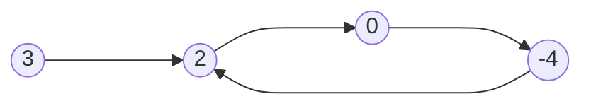
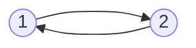
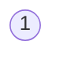


Difficulty: 


## Problem Description

### English (Linked List Cycle II)

Given the `head` of a linked list, return *the node where the cycle begins. If there is no cycle, return `null`*.

There is a cycle in a linked list if there is some node in the list that can be reached again by continuously following the `next` pointer. Internally, `pos` is used to denote the index of the node that tail's `next` pointer is connected to **(0-indexed)**. It is `-1` if there is no cycle. **Note that `pos` is not passed as a parameter**.

**Do not modify** the linked list.

**Example 1:**



```log
Input: head = [3,2,0,-4], pos = 1
Output: tail connects to node index 1
Explanation: There is a cycle in the linked list, where tail connects to the second node.
```

**Example 2:**



```log
Input: head = [1,2], pos = 0
Output: tail connects to node index 0
Explanation: There is a cycle in the linked list, where tail connects to the first node.
```

**Example 3:**



```log
Input: head = [1], pos = -1
Output: no cycle
Explanation: There is no cycle in the linked list.
```

**Constraints:**

- The number of the nodes in the list is in the range `[0, 10^4]`.
- `-10^5 <= Node.val <= 10^5`
- `pos` is `-1` or a **valid index** in the linked-list.

**Follow up:** Can you solve it using `O(1)` (i.e. constant) memory?

### Chinese (环形链表 II)

给定一个链表的头节点 `head` ，返回链表开始入环的第一个节点。 *如果链表无环，则返回 `null`。*

如果链表中有某个节点，可以通过连续跟踪 `next` 指针再次到达，则链表中存在环。 为了表示给定链表中的环，评测系统内部使用整数 pos 来表示链表尾连接到链表中的位置（**索引从 0 开始**）。如果 `pos` 是 `-1`，则在该链表中没有环。**注意：`pos` 不作为参数进行传递**，仅仅是为了标识链表的实际情况。

**不允许修改** 链表。

**示例 1：**


```log
输入：head = [3,2,0,-4], pos = 1
输出：返回索引为 1 的链表节点
解释：链表中有一个环，其尾部连接到第二个节点。
```

**示例 2：**


```log
输入：head = [1,2], pos = 0
输出：返回索引为 0 的链表节点
解释：链表中有一个环，其尾部连接到第一个节点。
```

**示例 3：**


```log
输入：head = [1], pos = -1
输出：返回 null
解释：链表中没有环。
```

**提示：**

- 链表中节点的数目范围在范围 `[0, 10^4]` 内
- `-10^5 <= Node.val <= 10^5`
- `pos` 的值为 `-1` 或者链表中的一个有效索引

**进阶：** 你是否可以使用 `O(1)` 空间解决此题？

## Solution

```C++
/**
 * Definition for singly-linked list.
 */
struct ListNode {
    int val;
    ListNode* next;
    ListNode(int x) : val(x), next(NULL) {}
};

class Solution {
public:
    ListNode* detectCycle(ListNode* head) {
        ListNode* cycle_node = nodeInCycle(head);
        if (cycle_node == nullptr) {
            return nullptr;
        }

        ListNode* curr = head;
        while (curr != cycle_node) {
            curr = curr->next;
            cycle_node = cycle_node->next;
        }

        return curr;
    }

private:
    static ListNode* nodeInCycle(ListNode* head) {
        ListNode* fast = head;
        ListNode* slow = head;

        while (fast != nullptr && fast->next != nullptr) {
            slow = slow->next;
            fast = fast->next->next;

            if (slow == fast) {
                return fast;
            }
        }

        return nullptr;
    }
};
```
