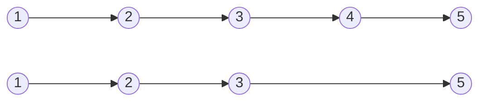


Difficulty: 


## Problem Description

### English (Remove Nth Node From End of List)

Given the `head` of a linked list, remove the `nth` node from the end of the list and return its head.

**Example 1:**



```log
Input: head = [1,2,3,4,5], n = 2
Output: [1,2,3,5]
```

**Example 2:**

```log
Input: head = [1], n = 1
Output: []
```

**Example 3:**

```log
Input: head = [1,2], n = 1
Output: [1]
```

**Constraints:**

- The number of nodes in the list is `sz`.
- `1 <= sz <= 30`
- `0 <= Node.val <= 100`
- `1 <= n <= sz`

**Follow up:** Could you do this in one pass?

### Chinese (删除链表的倒数第 N 个结点)

给你一个链表，删除链表的倒数第 n 个结点，并且返回链表的头结点。

**示例 1：**


```log
输入：head = [1,2,3,4,5], n = 2
输出：[1,2,3,5]
```

**示例 2：**

```log
输入：head = [1], n = 1
输出：[]
```

**示例 3：**

```log
输入：head = [1,2], n = 1
输出：[1]
```

**提示：**

- 链表中结点的数目为 `sz`
- `1 <= sz <= 30`
- `0 <= Node.val <= 100`
- `1 <= n <= sz`

**进阶：** 你能尝试使用一趟扫描实现吗？

## Solution

```C++
/**
 * Definition for singly-linked list.
 */
struct ListNode {
    int val;
    ListNode* next;
    ListNode() : val(0), next(nullptr) {}
    ListNode(int x) : val(x), next(nullptr) {}
    ListNode(int x, ListNode* next) : val(x), next(next) {}
};

class Solution {
public:
    ListNode* removeNthFromEnd(ListNode* head, int n) {
        ListNode* last = head;
        for (int i = 0; i < n; ++i) {
            last = last->next;
        }

        ListNode* dummy = new ListNode(0, head);
        ListNode* prev = dummy;
        ListNode* curr = head;
        while (last != nullptr) {
            prev = prev->next;
            curr = curr->next;
            last = last->next;
        }

        prev->next = curr->next;
        delete curr;

        head = dummy->next;
        delete dummy;
        return head;
    }
};
```
