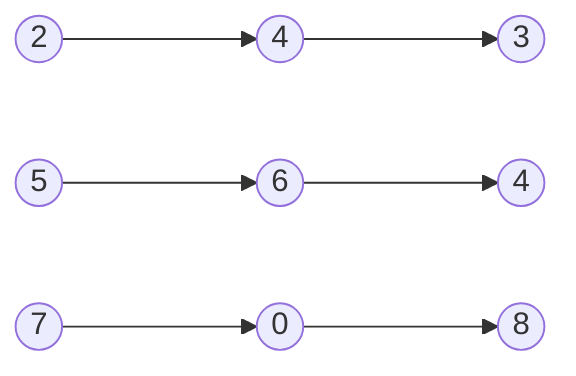


Difficulty: 


## Problem Description

### English (Add Two Numbers)

You are given two **non-empty** linked lists representing two non-negative integers. The digits are stored in **reverse order**, and each of their nodes contains a single digit. Add the two numbers and return the sumas a linked list.

You may assume the two numbers do not contain any leading zero, except the number 0 itself.

**Example 1:**



```log
Input: l1 = [2,4,3], l2 = [5,6,4]
Output: [7,0,8]
Explanation: 342 + 465 = 807.
```

**Example 2:**

```log
Input: l1 = [0], l2 = [0]
Output: [0]
```

**Example 3:**

```log
Input: l1 = [9,9,9,9,9,9,9], l2 = [9,9,9,9]
Output: [8,9,9,9,0,0,0,1]
```

**Constraints:**

- The number of nodes in each linked list is in the range `[1, 100]`.
- `0 <= Node.val <= 9`
- It is guaranteed that the list represents a number that does not have leading zeros.

### Chinese (两数相加)

给你两个 **非空** 的链表，表示两个非负的整数。它们每位数字都是按照 **逆序** 的方式存储的，并且每个节点只能存储 **一位** 数字。

请你将两个数相加，并以相同形式返回一个表示和的链表。

你可以假设除了数字 0 之外，这两个数都不会以 0 开头。

**示例 1：**


```log
输入：l1 = [2,4,3], l2 = [5,6,4]
输出：[7,0,8]
解释：342 + 465 = 807.
```

**示例 2：**

```log
输入：l1 = [0], l2 = [0]
输出：[0]
```

**示例 3：**

```log
输入：l1 = [9,9,9,9,9,9,9], l2 = [9,9,9,9]
输出：[8,9,9,9,0,0,0,1]
```

**提示：**

- 每个链表中的节点数在范围 `[1, 100]` 内
- `0 <= Node.val <= 9`
- 题目数据保证列表表示的数字不含前导零

## Solution

### C++

```C++
/**
 * Definition for singly-linked list.
 */
struct ListNode {
    int val;
    ListNode* next;
    ListNode() : val(0), next(nullptr) {}
    ListNode(int x) : val(x), next(nullptr) {}
    ListNode(int x, ListNode* next) : val(x), next(next) {}
};

class Solution {
public:
    ListNode* addTwoNumbers(ListNode* l1, ListNode* l2) {
        ListNode* dummy = new ListNode;
        ListNode* last = dummy;
        int carry = 0;

        while (l1 && l2) {
            int sum = l1->val + l2->val + carry;
            last->next = new ListNode(sum % 10);
            carry = sum / 10;

            l1 = l1->next;
            l2 = l2->next;
            last = last->next;
        }

        while (l1) {
            int sum = l1->val + carry;
            last->next = new ListNode(sum % 10);
            carry = sum / 10;

            l1 = l1->next;
            last = last->next;
        }

        while (l2) {
            int sum = l2->val + carry;
            last->next = new ListNode(sum % 10);
            carry = sum / 10;

            l2 = l2->next;
            last = last->next;
        }

        if (carry) {
            last->next = new ListNode(carry);
            last = last->next;
        }

        ListNode* head = dummy->next;
        delete dummy;
        return head;
    }
};
```
