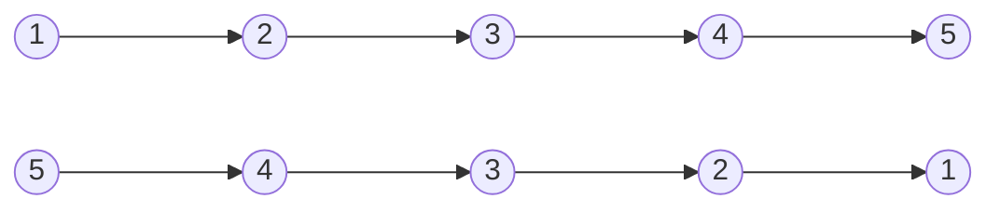
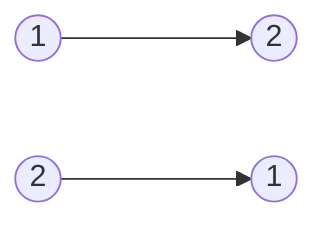


Difficulty: 


## Problem Description

### English (Reverse Linked List)

Given the `head` of a singly linked list, reverse the list, and return the reversed list.

**Example 1:**



```log
Input: head = [1,2,3,4,5]
Output: [5,4,3,2,1]
```

**Example 2:**



```log
Input: head = [1,2]
Output: [2,1]
```

**Example 3:**

```log
Input: head = []
Output: []
```

**Constraints:**

- The number of nodes in the list is the range `[0, 5000]`.
- `-5000 <= Node.val <= 5000`

**Follow up:** A linked list can be reversed either **iteratively** or **recursively**. Could you implement both?

### Chinese (反转链表)

给你单链表的头节点 head ，请你反转链表，并返回反转后的链表。

**示例 1：**


```log
输入：head = [1,2,3,4,5]
输出：[5,4,3,2,1]
```

**示例 2：**


```log
输入：head = [1,2]
输出：[2,1]
```

**示例 3：**

```log
输入：head = []
输出：[]
```

**提示：**

- 链表中节点的数目范围是 `[0, 5000]`
- `-5000 <= Node.val <= 5000`

**进阶：** 链表可以选用迭代或递归方式完成反转。你能否用两种方法解决这道题？

## Solution

### Iterative

```C++
/**
 * Definition for singly-linked list.
 */
struct ListNode {
    int val;
    ListNode* next;
    ListNode() : val(0), next(nullptr) {}
    ListNode(int x) : val(x), next(nullptr) {}
    ListNode(int x, ListNode* next) : val(x), next(next) {}
};

class Solution {
public:
    ListNode* reverseList(ListNode* head) {
        ListNode* prev = nullptr;
        ListNode* curr = head;
        while (curr != nullptr) {
            ListNode* next = curr->next;
            curr->next = prev;

            prev = curr;
            curr = next;
        }

        return prev;
    }
};
```

### Recursive

```C++
/**
 * Definition for singly-linked list.
 */
struct ListNode {
    int val;
    ListNode* next;
    ListNode() : val(0), next(nullptr) {}
    ListNode(int x) : val(x), next(nullptr) {}
    ListNode(int x, ListNode* next) : val(x), next(next) {}
};

class Solution {
public:
    ListNode* reverseList(ListNode* head) {
        if (head == nullptr || head->next == nullptr) {
            return head;
        }

        ListNode* next_tail = head->next;
        ListNode* next_head = reverseList(head->next);
        next_tail->next = head;
        head->next = nullptr;

        return next_head;
    }
};
```
