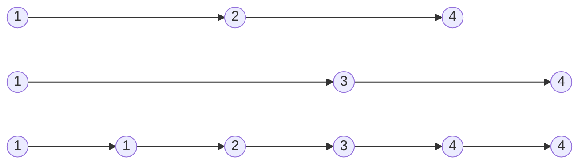


Difficulty: 


## Problem Description

### English (Merge Two Sorted Lists)

You are given the heads of two sorted linked lists `list1` and `list2`.

Merge the two lists in a one **sorted** list. The list should be made by splicing together the nodes of the first two lists.

Return *the head of the merged linked list*.

**Example 1:**



```log
Input: list1 = [1,2,4], list2 = [1,3,4]
Output: [1,1,2,3,4,4]
```

**Example 2:**

```log
Input: list1 = [], list2 = []
Output: []
```

**Example 3:**

```log
Input: list1 = [], list2 = [0]
Output: [0]
```

**Constraints:**

- The number of nodes in both lists is in the range `[0, 50]`.
- `-100 <= Node.val <= 100`
- Both `list1` and `list2` are sorted in **non-decreasing** order.

### Chinese (合并两个有序链表)

将两个升序链表合并为一个新的 **升序** 链表并返回。新链表是通过拼接给定的两个链表的所有节点组成的。

**示例 1：**


```log
输入：l1 = [1,2,4], l2 = [1,3,4]
输出：[1,1,2,3,4,4]
```

**示例 2：**

```log
输入：l1 = [], l2 = []
输出：[]
```

**示例 3：**

```log
输入：l1 = [], l2 = [0]
输出：[0]
```

**提示：**

- 两个链表的节点数目范围是 `[0, 50]`
- `-100 <= Node.val <= 100`
- `l1` 和 `l2` 均按 **非递减顺序** 排列

## Solution

```C++
/**
 * Definition for singly-linked list.
 */
struct ListNode {
    int val;
    ListNode* next;
    ListNode() : val(0), next(nullptr) {}
    ListNode(int x) : val(x), next(nullptr) {}
    ListNode(int x, ListNode* next) : val(x), next(next) {}
};

class Solution {
public:
    ListNode* mergeTwoLists(ListNode* list1, ListNode* list2) {
        ListNode* dummy = new ListNode;

        ListNode* last = dummy;
        while (list1 && list2) {
            if (list1->val <= list2->val) {
                last->next = list1;
                list1 = list1->next;
            } else {
                last->next = list2;
                list2 = list2->next;
            }

            last = last->next;
        }

        if (list1) {
            last->next = list1;
        }
        if (list2) {
            last->next = list2;
        }

        ListNode* head = dummy->next;
        delete dummy;
        return head;
    }
};
```
