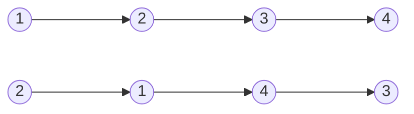


Difficulty: 


## Problem Description

### English (Swap Nodes in Pairs)

Given a linked list, swap every two adjacent nodes and return its head. You must solve the problem without modifying the values in the list's nodes (i.e., only nodes themselves may be changed.)

**Example 1:**



```log
Input: head = [1,2,3,4]
Output: [2,1,4,3]
```

**Example 2:**

```log
Input: head = []
Output: []
```

**Example 3:**

```log
Input: head = [1]
Output: [1]
```

**Constraints:**

- The number of nodes in the list is in the range `[0, 100]`.
- `0 <= Node.val <= 100`

### Chinese (两两交换链表中的节点)

给你一个链表，两两交换其中相邻的节点，并返回交换后链表的头节点。你必须在不修改节点内部的值的情况下完成本题（即，只能进行节点交换）。

**示例 1：**


```log
输入：head = [1,2,3,4]
输出：[2,1,4,3]
```

**示例 2：**

```log
输入：head = []
输出：[]
```

**示例 3：**

```log
输入：head = [1]
输出：[1]
```

**提示：**

- 链表中节点的数目在范围 `[0, 100]` 内
- `0 <= Node.val <= 100`

## Solution

```C++
/**
 * Definition for singly-linked list.
 */
struct ListNode {
    int val;
    ListNode* next;
    ListNode() : val(0), next(nullptr) {}
    ListNode(int x) : val(x), next(nullptr) {}
    ListNode(int x, ListNode* next) : val(x), next(next) {}
};

class Solution {
public:
    ListNode* swapPairs(ListNode* head) {
        ListNode* dummy = new ListNode(0, head);

        ListNode* curr = dummy;
        while (curr->next != nullptr && curr->next->next != nullptr) {
            ListNode* first = curr->next;
            ListNode* second = curr->next->next;
            ListNode* next_pair = curr->next->next->next;

            curr->next = second;
            second->next = first;
            first->next = next_pair;

            curr = first;
        }

        head = dummy->next;
        delete dummy;
        return head;
    }
};
```
