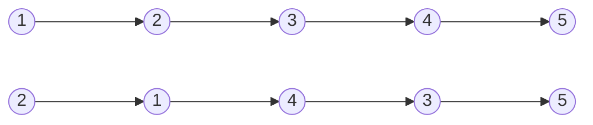
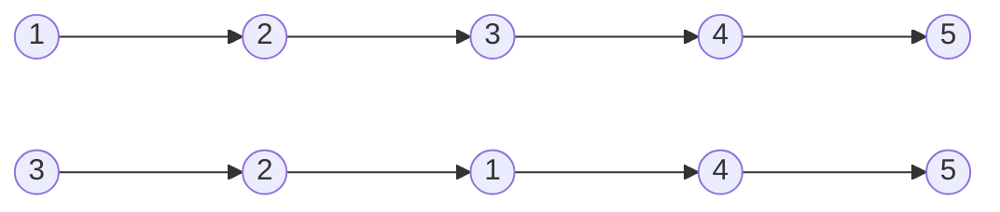


Difficulty: 


## Problem Description

### English (Reverse Nodes in k-Group)

Given the `head` of a linked list, reverse the nodes of the list `k` at a time, and return *the modified list*.

`k` is a positive integer and is less than or equal to the length of the linked list. If the number of nodes is not a multiple of `k` then left-out nodes, in the end, should remain as it is.

You may not alter the values in the list's nodes, only nodes themselves may be changed.

**Example 1:**



```log
Input: head = [1,2,3,4,5], k = 2
Output: [2,1,4,3,5]
```

**Example 2:**



```log
Input: head = [1,2,3,4,5], k = 3
Output: [3,2,1,4,5]
```

**Constraints:**

- The number of nodes in the list is `n`.
- `1 <= k <= n <= 5000`
- `0 <= Node.val <= 1000`

**Follow-up:** Can you solve the problem in O(1) extra memory space?

### Chinese (K 个一组翻转链表)

给你链表的头节点 `head` ，每 `k` 个节点一组进行翻转，请你返回修改后的链表。

`k` 是一个正整数，它的值小于或等于链表的长度。如果节点总数不是 `k` 的整数倍，那么请将最后剩余的节点保持原有顺序。

你不能只是单纯的改变节点内部的值，而是需要实际进行节点交换。

**示例 1：**


```log
输入：head = [1,2,3,4,5], k = 2
输出：[2,1,4,3,5]
```

**示例 2：**


```log
输入：head = [1,2,3,4,5], k = 3
输出：[3,2,1,4,5]
```

**提示：**

- 链表中的节点数目为 `n`
- `1 <= k <= n <= 5000`
- `0 <= Node.val <= 1000`

**进阶：** 你可以设计一个只用 `O(1)` 额外内存空间的算法解决此问题吗？

## Solution

```C++
/**
 * Definition for singly-linked list.
 */
struct ListNode {
    int val;
    ListNode* next;
    ListNode() : val(0), next(nullptr) {}
    ListNode(int x) : val(x), next(nullptr) {}
    ListNode(int x, ListNode* next) : val(x), next(next) {}
};

class Solution {
public:
    ListNode* reverseKGroup(ListNode* head, int k) {
        ListNode* dummy = new ListNode(0, head);

        ListNode* lastInPreviousGroup = dummy;
        ListNode* firstInCurrentGroup = head;
        while (firstInCurrentGroup != nullptr) {
            ListNode* lastInCurrentGroup = getLastInGroup(firstInCurrentGroup, k);
            if (lastInCurrentGroup == nullptr) {
                break;
            }

            ListNode* firstInNextGroup = lastInCurrentGroup->next;

            // break out the connections with the previous/next group
            lastInPreviousGroup->next = nullptr;
            lastInCurrentGroup->next = nullptr;

            // reverse in group
            lastInCurrentGroup = firstInCurrentGroup;
            firstInCurrentGroup = reverseList(firstInCurrentGroup);

            // resume the connections with the previous/next group
            lastInPreviousGroup->next = firstInCurrentGroup;
            lastInCurrentGroup->next = firstInNextGroup;

            // update the pilot pointers
            lastInPreviousGroup = lastInCurrentGroup;
            firstInCurrentGroup = firstInNextGroup;
        }

        head = dummy->next;
        delete dummy;
        return head;
    }

private:
    static ListNode* moveDistance(ListNode* head, int distance) {
        ListNode* curr = head;
        for (int i = 0; i < distance && curr != nullptr; ++i) {
            curr = curr->next;
        }
        return curr;
    }

    static ListNode* getLastInGroup(ListNode* head, int group_size) {
        return moveDistance(head, group_size - 1);
    }

    static ListNode* reverseList(ListNode* head) {
        ListNode* prev = nullptr;
        ListNode* curr = head;
        while (curr != nullptr) {
            ListNode* next = curr->next;
            curr->next = prev;

            prev = curr;
            curr = next;
        }

        return prev;
    }
};
```
