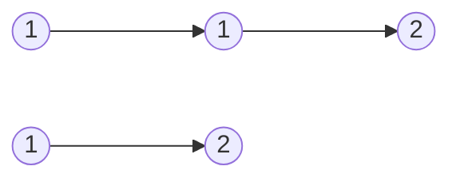
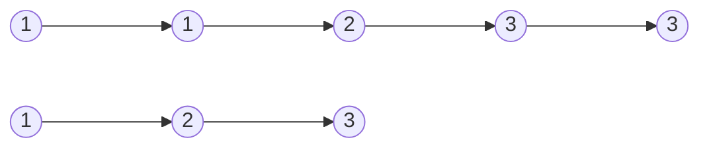


Difficulty: 


## Problem Description

### English (Remove Duplicates from Sorted List)

Given the `head` of a sorted linked list, *delete all duplicates such that each element appears only once*. Return *the linked list **sorted** as well*.

**Example 1:**



```log
Input: head = [1,1,2]
Output: [1,2]
```

**Example 2:**



```log
Input: head = [1,1,2,3,3]
Output: [1,2,3]
```

**Constraints:**

- The number of nodes in the list is in the range `[0, 300]`.
- `-100 <= Node.val <= 100`
- The list is guaranteed to be **sorted** in ascending order.

### Chinese (删除排序链表中的重复元素)

给定一个已排序的链表的头 `head` ， *删除所有重复的元素，使每个元素只出现一次* 。返回 *已排序的链表* 。

**示例 1：**


```log
输入：head = [1,1,2]
输出：[1,2]
```

**示例 2：**


```log
输入：head = [1,1,2,3,3]
输出：[1,2,3]
```

**提示：**

- 链表中节点数目在范围 `[0, 300]` 内
- `-100 <= Node.val <= 100`
- 题目数据保证链表已经按 **升序** 排列

## Solution

```C++
/**
 * Definition for singly-linked list.
 */
struct ListNode {
    int val;
    ListNode* next;
    ListNode() : val(0), next(nullptr) {}
    ListNode(int x) : val(x), next(nullptr) {}
    ListNode(int x, ListNode* next) : val(x), next(next) {}
};

class Solution {
public:
    ListNode* deleteDuplicates(ListNode* head) {
        if (head == nullptr) {
            return nullptr;
        }

        ListNode* prev = head;
        ListNode* curr = head->next;
        while (curr != nullptr) {
            ListNode* next = curr->next;

            if (prev->val == curr->val) {
                prev->next = next;
                delete curr;
                curr = next;
            } else {
                prev = curr;
                curr = next;
            }
        }

        return head;
    }
};
```
