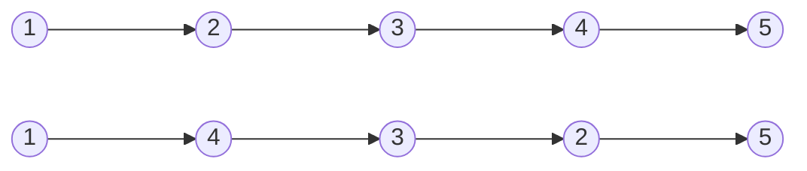


Difficulty: 


## Problem Description

### English (Reverse Linked List II)

Given the `head` of a singly linked list and two integers `left` and `right` where `left <= right`, reverse the nodes of the list from position `left` to position `right`, and return the reversed list.

**Example 1:**



```log
Input: head = [1,2,3,4,5], left = 2, right = 4
Output: [1,4,3,2,5]
```

**Example 2:**

```log
Input: head = [5], left = 1, right = 1
Output: [5]
```

**Constraints:**

- The number of nodes in the list is `n`.
- `1 <= n <= 500`
- `-500 <= Node.val <= 500`
- `1 <= left <= right <= n`

**Follow up:** Could you do it in one pass?

### Chinese (环形链表 II)

给你单链表的头指针 `head` 和两个整数 `left` 和 `right` ，其中 `left <= right` 。请你反转从位置 `left` 到位置 `right` 的链表节点，返回 反转后的链表 。

**示例 1：**


```log
输入：head = [1,2,3,4,5], left = 2, right = 4
输出：[1,4,3,2,5]
```

**示例 2：**

```log
输入：head = [5], left = 1, right = 1
输出：[5]
```

**提示：**

- 链表中节点数目为 `n`
- `1 <= n <= 500`
- `-500 <= Node.val <= 500`
- `1 <= left <= right <= n`

**进阶：** 你可以使用一趟扫描完成反转吗？

## Solution

```C++
/**
 * Definition for singly-linked list.
 */
struct ListNode {
    int val;
    ListNode* next;
    ListNode() : val(0), next(nullptr) {}
    ListNode(int x) : val(x), next(nullptr) {}
    ListNode(int x, ListNode* next) : val(x), next(next) {}
};

class Solution {
public:
    ListNode* reverseBetween(ListNode* head, int left, int right) {
        ListNode* dummy = new ListNode(0, head);

        ListNode* lastNodeInPreviousGroup = moveDistance(dummy, left - 1);
        ListNode* leftNode = lastNodeInPreviousGroup->next;
        ListNode* rightNode = moveDistance(dummy, right);
        ListNode* firstNodeInNextGroup = rightNode->next;

        // break out the connections with the previous/next group
        lastNodeInPreviousGroup->next = nullptr;
        rightNode->next = nullptr;

        // reverse in group
        rightNode = leftNode;
        leftNode = reverseList(leftNode);

        // resume the connections with the previous/next group
        lastNodeInPreviousGroup->next = leftNode;
        rightNode->next = firstNodeInNextGroup;

        head = dummy->next;
        delete dummy;
        return head;
    }

private:
    static ListNode* moveDistance(ListNode* head, int distance) {
        ListNode* curr = head;
        for (int i = 0; i < distance && curr != nullptr; ++i) {
            curr = curr->next;
        }
        return curr;
    }

    static ListNode* reverseList(ListNode* head) {
        ListNode* prev = nullptr;
        ListNode* curr = head;
        while (curr != nullptr) {
            ListNode* next = curr->next;
            curr->next = prev;

            prev = curr;
            curr = next;
        }

        return prev;
    }
};
```
