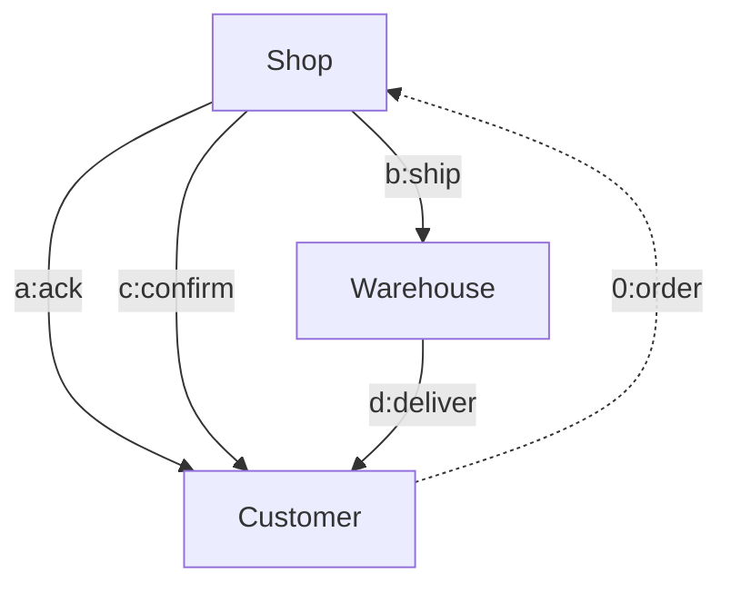
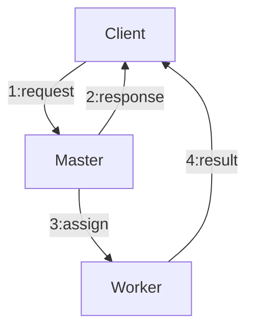


muduo: <https://github.com/chenshuo/muduo>



本系列是 [《Linux 多线程服务端编程：使用 muduo C++ 网络库》](https://chenshuo.com/book/) 学习笔记。

**Part 9: 分布式系统工程实践**


## 险恶的分布式问题

消息传递的延时性不固定，时间与事件顺序违反直觉。

### Case 1

Customer 收到的 3 条消息有 3 种可能的顺序

1. a, c, d
2. a, d, c
3. d, a, c

### Case 2

`"4:result"` 完全有可能先于 `"2:response"` 到达客户端。

## 分布式系统中心跳协议的设计

有两个关键点：

1. 要在工作线程发送，不要单独起一个“心跳线程”。
   原因：防止工作线程死锁或阻塞时还在继续发心跳。
2. 与业务消息用同一个连接，不要单独用“心跳连接”。
   原因：验证本连接网络畅通，以及本连接实际没有被防火墙切断。

## 分布式系统中的进程标识

### 错误做法

#### `ip:port`

对于无状态服务没问题，但对于有状态服务来说无法区分状态。

#### `host:pid`

`pid` 的状态空间很小，重启后获得与“前世”相同 pid 的概率为 1/32768，存在相同的可能，存在风险。

### 正确做法

采用 `ip:port:start_time:pid`。

好处：

- 容易保证唯一性。如果程序短时间内重启，那么前后两个进程的 pid 必定不重复（就算每秒创建 1000 个进程，也要 30 多秒才会轮回，而以这么高的速度创建进程的话，服务器基本瘫痪了）。如果程序运行了相当长的一段时间再重启，那么两次启动的 start_time 必定不重复。
- 产生这种 gpid（全局描述符） 的成本很低，只有几次低成本系统调用。
- gpid 本身有意义。有 ip（机器位置）、port（什么进程）、start_time（启动时间）、pid（在 `/prod` 目录中的位置 `/prod/pid`） 各种信息。
- gpid 具有历史意义，便于将来追溯。比如进程 crash，可以根据 gpid 去历史记录中查询它 crash 之前的 CPU 和内存负载有多大。

## 一种自动化的回归测试方案

对于分布式系统的两个模块 A 和 B。

- mock B 验证测试 A 正常和异常的情况。
- mock A 验证测试 B 正常和异常的情况。

使得被观察的 A、B 像是缸中之脑。
