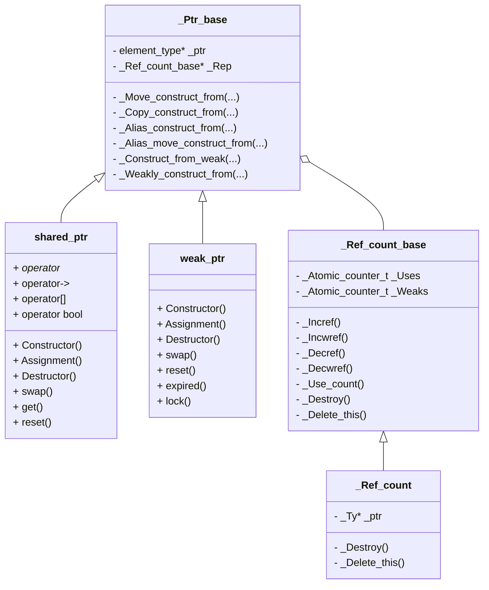
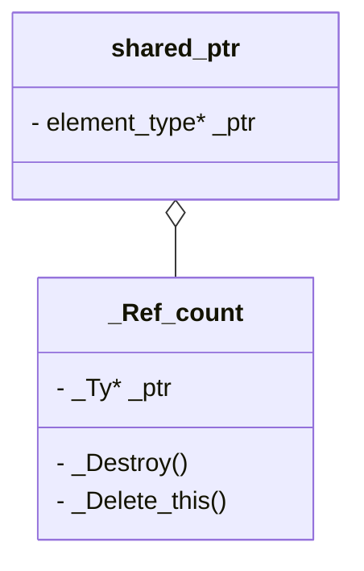


The implementation of `std::shared_ptr` shown in this page is from MSVC STL.


## Architecture




Note that `element_type* _ptr` in `_Ptr_base` isn't the same with `_Ty* _ptr` in `_Ref_count` strictly.


## Control Block (`_Ref_count_base`)

```C++
// The abstract base class of control block
class __declspec(novtable) _Ref_count_base { // common code for reference counting
private:
    // The implementations are in derived class
    virtual void _Destroy() noexcept     = 0; // destroy managed resource (target object)
    virtual void _Delete_this() noexcept = 0; // destroy self

    _Atomic_counter_t _Uses  = 1;
    _Atomic_counter_t _Weaks = 1;

protected:
    constexpr _Ref_count_base() noexcept = default; // non-atomic initializations

public:
    _Ref_count_base(const _Ref_count_base&) = delete;
    _Ref_count_base& operator=(const _Ref_count_base&) = delete;

    virtual ~_Ref_count_base() noexcept {} // TRANSITION, should be non-virtual

    bool _Incref_nz() noexcept { // increment use count if not zero, return true if successful
        auto& _Volatile_uses = reinterpret_cast<volatile long&>(_Uses);
        long _Count = __iso_volatile_load32(reinterpret_cast<volatile int*>(&_Volatile_uses));

        while (_Count != 0) {
            const long _Old_value = _INTRIN_RELAXED(_InterlockedCompareExchange)(&_Volatile_uses, _Count + 1, _Count);
            if (_Old_value == _Count) {
                return true;
            }

            _Count = _Old_value;
        }

        return false;
    }

    void _Incref() noexcept { // increment use count
        _MT_INCR(_Uses);
    }

    void _Incwref() noexcept { // increment weak reference count
        _MT_INCR(_Weaks);
    }

    void _Decref() noexcept { // decrement use count
        if (_MT_DECR(_Uses) == 0) {
            _Destroy();
            _Decwref();
        }
    }

    void _Decwref() noexcept { // decrement weak reference count
        if (_MT_DECR(_Weaks) == 0) {
            _Delete_this();
        }
    }

    long _Use_count() const noexcept {
        return static_cast<long>(_Uses);
    }

    virtual void* _Get_deleter(const type_info&) const noexcept {
        return nullptr;
    }
};
```

```C++
template <class _Ty>
class _Ref_count : public _Ref_count_base { // handle reference counting for pointer without deleter
public:
    explicit _Ref_count(_Ty* _Px) : _Ref_count_base(), _Ptr(_Px) {}

private:
    void _Destroy() noexcept override { // destroy managed resource
        delete _Ptr;
    }

    void _Delete_this() noexcept override { // destroy self
        delete this;
    }

    _Ty* _Ptr;
};
```

## `Ptr_base`

```C++
template <class _Ty>
class _Ptr_base { // base class for `shared_ptr` and `weak_ptr`
public:
    using element_type = remove_extent_t<_Ty>;

    _NODISCARD long use_count() const noexcept {
        return _Rep ? _Rep->_Use_count() : 0;
    }

    template <class _Ty2>
    _NODISCARD bool owner_before(const _Ptr_base<_Ty2>& _Right) const noexcept { // compare addresses of manager objects
        return _Rep < _Right._Rep;
    }

    _Ptr_base(const _Ptr_base&) = delete;
    _Ptr_base& operator=(const _Ptr_base&) = delete;

protected:
    _NODISCARD element_type* get() const noexcept {
        return _Ptr;
    }

    constexpr _Ptr_base() noexcept = default;

    ~_Ptr_base() = default;

    template <class _Ty2>
    void _Move_construct_from(_Ptr_base<_Ty2>&& _Right) noexcept {
        // implement shared_ptr's (converting) move ctor and weak_ptr's move ctor
        _Ptr = _Right._Ptr;
        _Rep = _Right._Rep;

        _Right._Ptr = nullptr;
        _Right._Rep = nullptr;
    }

    template <class _Ty2>
    void _Copy_construct_from(const shared_ptr<_Ty2>& _Other) noexcept {
        // implement shared_ptr's (converting) copy ctor
        _Other._Incref();

        _Ptr = _Other._Ptr;
        _Rep = _Other._Rep;
    }

    template <class _Ty2>
    void _Alias_construct_from(const shared_ptr<_Ty2>& _Other, element_type* _Px) noexcept {
        // implement shared_ptr's aliasing ctor
        _Other._Incref();

        _Ptr = _Px;
        _Rep = _Other._Rep;
    }

    template <class _Ty2>
    void _Alias_move_construct_from(shared_ptr<_Ty2>&& _Other, element_type* _Px) noexcept {
        // implement shared_ptr's aliasing move ctor
        _Ptr = _Px;
        _Rep = _Other._Rep;

        _Other._Ptr = nullptr;
        _Other._Rep = nullptr;
    }

    template <class _Ty0>
    friend class weak_ptr; // specifically, weak_ptr::lock()

    // weak -> shared
    template <class _Ty2>
    bool _Construct_from_weak(const weak_ptr<_Ty2>& _Other) noexcept {
        // implement shared_ptr's ctor from weak_ptr, and weak_ptr::lock()
        if (_Other._Rep && _Other._Rep->_Incref_nz()) {
            _Ptr = _Other._Ptr;
            _Rep = _Other._Rep;
            return true;
        }

        return false;
    }

    void _Incref() const noexcept {
        if (_Rep) {
            _Rep->_Incref();
        }
    }

    void _Decref() noexcept { // decrement reference count
        if (_Rep) {
            _Rep->_Decref();
        }
    }

    void _Swap(_Ptr_base& _Right) noexcept { // swap pointers
        _STD swap(_Ptr, _Right._Ptr);
        _STD swap(_Rep, _Right._Rep);
    }

    // shared -> weak
    template <class _Ty2>
    void _Weakly_construct_from(const _Ptr_base<_Ty2>& _Other) noexcept { // implement weak_ptr's ctors
        if (_Other._Rep) {
            _Ptr = _Other._Ptr;
            _Rep = _Other._Rep;
            _Rep->_Incwref();
        } else {
            _STL_INTERNAL_CHECK(!_Ptr && !_Rep);
        }
    }

    template <class _Ty2>
    void _Weakly_convert_lvalue_avoiding_expired_conversions(const _Ptr_base<_Ty2>& _Other) noexcept {
        // implement weak_ptr's copy converting ctor
        if (_Other._Rep) {
            _Rep = _Other._Rep; // always share ownership
            _Rep->_Incwref();

            if (_Rep->_Incref_nz()) {
                _Ptr = _Other._Ptr; // keep resource alive during conversion, handling virtual inheritance
                _Rep->_Decref();
            } else {
                _STL_INTERNAL_CHECK(!_Ptr);
            }
        } else {
            _STL_INTERNAL_CHECK(!_Ptr && !_Rep);
        }
    }

    template <class _Ty2>
    void _Weakly_convert_rvalue_avoiding_expired_conversions(_Ptr_base<_Ty2>&& _Other) noexcept {
        // implement weak_ptr's move converting ctor
        _Rep        = _Other._Rep; // always transfer ownership
        _Other._Rep = nullptr;

        if (_Rep && _Rep->_Incref_nz()) {
            _Ptr = _Other._Ptr; // keep resource alive during conversion, handling virtual inheritance
            _Rep->_Decref();
        } else {
            _STL_INTERNAL_CHECK(!_Ptr);
        }

        _Other._Ptr = nullptr;
    }

    void _Incwref() const noexcept {
        if (_Rep) {
            _Rep->_Incwref();
        }
    }

    void _Decwref() noexcept { // decrement weak reference count
        if (_Rep) {
            _Rep->_Decwref();
        }
    }

private:
    element_type* _Ptr{nullptr};
    _Ref_count_base* _Rep{nullptr};

    template <class _Ty0>
    friend class _Ptr_base;

    friend shared_ptr<_Ty>;

    template <class _Ty0>
    friend struct atomic;

    friend _Exception_ptr_access;

#if _HAS_STATIC_RTTI
    template <class _Dx, class _Ty0>
    friend _Dx* get_deleter(const shared_ptr<_Ty0>& _Sx) noexcept;
#endif // _HAS_STATIC_RTTI
};
```

## `shared_ptr`

```C++
template <class _Ty>
class shared_ptr : public _Ptr_base<_Ty> { // class for reference counted resource management
private:
    using _Mybase = _Ptr_base<_Ty>;

public:
    using typename _Mybase::element_type;

    using weak_type = weak_ptr<_Ty>;

    constexpr shared_ptr() noexcept = default;

    constexpr shared_ptr(nullptr_t) noexcept {} // construct empty shared_ptr

    template <class _Ux,
        enable_if_t<conjunction_v<conditional_t<is_array_v<_Ty>, _Can_array_delete<_Ux>, _Can_scalar_delete<_Ux>>,
                        _SP_convertible<_Ux, _Ty>>,
            int> = 0>
    explicit shared_ptr(_Ux* _Px) { // construct shared_ptr object that owns _Px
        if constexpr (is_array_v<_Ty>) {
            _Setpd(_Px, default_delete<_Ux[]>{});
        } else {
            _Temporary_owner<_Ux> _Owner(_Px);
            _Set_ptr_rep_and_enable_shared(_Owner._Ptr, new _Ref_count<_Ux>(_Owner._Ptr));
            _Owner._Ptr = nullptr;
        }
    }

    template <class _Ux, class _Dx,
        enable_if_t<conjunction_v<is_move_constructible<_Dx>, _Can_call_function_object<_Dx&, _Ux*&>,
                        _SP_convertible<_Ux, _Ty>>,
            int> = 0>
    shared_ptr(_Ux* _Px, _Dx _Dt) { // construct with _Px, deleter
        _Setpd(_Px, _STD move(_Dt));
    }

    template <class _Ux, class _Dx, class _Alloc,
        enable_if_t<conjunction_v<is_move_constructible<_Dx>, _Can_call_function_object<_Dx&, _Ux*&>,
                        _SP_convertible<_Ux, _Ty>>,
            int> = 0>
    shared_ptr(_Ux* _Px, _Dx _Dt, _Alloc _Ax) { // construct with _Px, deleter, allocator
        _Setpda(_Px, _STD move(_Dt), _Ax);
    }

    template <class _Dx,
        enable_if_t<conjunction_v<is_move_constructible<_Dx>, _Can_call_function_object<_Dx&, nullptr_t&>>, int> = 0>
    shared_ptr(nullptr_t, _Dx _Dt) { // construct with nullptr, deleter
        _Setpd(nullptr, _STD move(_Dt));
    }

    template <class _Dx, class _Alloc,
        enable_if_t<conjunction_v<is_move_constructible<_Dx>, _Can_call_function_object<_Dx&, nullptr_t&>>, int> = 0>
    shared_ptr(nullptr_t, _Dx _Dt, _Alloc _Ax) { // construct with nullptr, deleter, allocator
        _Setpda(nullptr, _STD move(_Dt), _Ax);
    }

    template <class _Ty2>
    shared_ptr(const shared_ptr<_Ty2>& _Right, element_type* _Px) noexcept {
        // construct shared_ptr object that aliases _Right
        this->_Alias_construct_from(_Right, _Px);
    }

    template <class _Ty2>
    shared_ptr(shared_ptr<_Ty2>&& _Right, element_type* _Px) noexcept {
        // move construct shared_ptr object that aliases _Right
        this->_Alias_move_construct_from(_STD move(_Right), _Px);
    }

    shared_ptr(const shared_ptr& _Other) noexcept { // construct shared_ptr object that owns same resource as _Other
        this->_Copy_construct_from(_Other);
    }

    template <class _Ty2, enable_if_t<_SP_pointer_compatible<_Ty2, _Ty>::value, int> = 0>
    shared_ptr(const shared_ptr<_Ty2>& _Other) noexcept {
        // construct shared_ptr object that owns same resource as _Other
        this->_Copy_construct_from(_Other);
    }

    shared_ptr(shared_ptr&& _Right) noexcept { // construct shared_ptr object that takes resource from _Right
        this->_Move_construct_from(_STD move(_Right));
    }

    template <class _Ty2, enable_if_t<_SP_pointer_compatible<_Ty2, _Ty>::value, int> = 0>
    shared_ptr(shared_ptr<_Ty2>&& _Right) noexcept { // construct shared_ptr object that takes resource from _Right
        this->_Move_construct_from(_STD move(_Right));
    }

    // Upgrade from weak_ptr to shared_ptr
    template <class _Ty2, enable_if_t<_SP_pointer_compatible<_Ty2, _Ty>::value, int> = 0>
    explicit shared_ptr(const weak_ptr<_Ty2>& _Other) { // construct shared_ptr object that owns resource *_Other
        if (!this->_Construct_from_weak(_Other)) {
            _Throw_bad_weak_ptr();
        }
    }

    template <class _Ux, class _Dx,
        enable_if_t<conjunction_v<_SP_pointer_compatible<_Ux, _Ty>,
                        is_convertible<typename unique_ptr<_Ux, _Dx>::pointer, element_type*>>,
            int> = 0>
    shared_ptr(unique_ptr<_Ux, _Dx>&& _Other) {
        using _Fancy_t   = typename unique_ptr<_Ux, _Dx>::pointer;
        using _Raw_t     = typename unique_ptr<_Ux, _Dx>::element_type*;
        using _Deleter_t = conditional_t<is_reference_v<_Dx>, decltype(_STD ref(_Other.get_deleter())), _Dx>;

        const _Fancy_t _Fancy = _Other.get();

        if (_Fancy) {
            const _Raw_t _Raw = _Fancy;
            const auto _Rx =
                new _Ref_count_resource<_Fancy_t, _Deleter_t>(_Fancy, _STD forward<_Dx>(_Other.get_deleter()));
            _Set_ptr_rep_and_enable_shared(_Raw, _Rx);
            _Other.release();
        }
    }

    ~shared_ptr() noexcept { // release resource
        this->_Decref();
    }

    shared_ptr& operator=(const shared_ptr& _Right) noexcept {
        shared_ptr(_Right).swap(*this);
        return *this;
    }

    template <class _Ty2>
    shared_ptr& operator=(const shared_ptr<_Ty2>& _Right) noexcept {
        shared_ptr(_Right).swap(*this);
        return *this;
    }

    shared_ptr& operator=(shared_ptr&& _Right) noexcept { // take resource from _Right
        shared_ptr(_STD move(_Right)).swap(*this);
        return *this;
    }

    template <class _Ty2>
    shared_ptr& operator=(shared_ptr<_Ty2>&& _Right) noexcept { // take resource from _Right
        shared_ptr(_STD move(_Right)).swap(*this);
        return *this;
    }

    template <class _Ux, class _Dx>
    shared_ptr& operator=(unique_ptr<_Ux, _Dx>&& _Right) { // move from unique_ptr
        shared_ptr(_STD move(_Right)).swap(*this);
        return *this;
    }

    void swap(shared_ptr& _Other) noexcept {
        this->_Swap(_Other);
    }

    void reset() noexcept { // release resource and convert to empty shared_ptr object
        shared_ptr().swap(*this);
    }

    template <class _Ux>
    void reset(_Ux* _Px) { // release, take ownership of _Px
        shared_ptr(_Px).swap(*this);
    }

    template <class _Ux, class _Dx>
    void reset(_Ux* _Px, _Dx _Dt) { // release, take ownership of _Px, with deleter _Dt
        shared_ptr(_Px, _Dt).swap(*this);
    }

    template <class _Ux, class _Dx, class _Alloc>
    void reset(_Ux* _Px, _Dx _Dt, _Alloc _Ax) { // release, take ownership of _Px, with deleter _Dt, allocator _Ax
        shared_ptr(_Px, _Dt, _Ax).swap(*this);
    }

    using _Mybase::get;

    template <class _Ty2 = _Ty, enable_if_t<!disjunction_v<is_array<_Ty2>, is_void<_Ty2>>, int> = 0>
    _NODISCARD _Ty2& operator*() const noexcept {
        return *get();
    }

    template <class _Ty2 = _Ty, enable_if_t<!is_array_v<_Ty2>, int> = 0>
    _NODISCARD _Ty2* operator->() const noexcept {
        return get();
    }

    template <class _Ty2 = _Ty, class _Elem = element_type, enable_if_t<is_array_v<_Ty2>, int> = 0>
    _NODISCARD _Elem& operator[](ptrdiff_t _Idx) const noexcept /* strengthened */ {
        return get()[_Idx];
    }

    explicit operator bool() const noexcept {
        return get() != nullptr;
    }

private:
    template <class _UxptrOrNullptr, class _Dx>
    void _Setpd(const _UxptrOrNullptr _Px, _Dx _Dt) { // take ownership of _Px, deleter _Dt
        _Temporary_owner_del<_UxptrOrNullptr, _Dx> _Owner(_Px, _Dt);
        _Set_ptr_rep_and_enable_shared(
            _Owner._Ptr, new _Ref_count_resource<_UxptrOrNullptr, _Dx>(_Owner._Ptr, _STD move(_Dt)));
        _Owner._Call_deleter = false;
    }

    template <class _UxptrOrNullptr, class _Dx, class _Alloc>
    void _Setpda(const _UxptrOrNullptr _Px, _Dx _Dt, _Alloc _Ax) { // take ownership of _Px, deleter _Dt, allocator _Ax
        using _Alref_alloc = _Rebind_alloc_t<_Alloc, _Ref_count_resource_alloc<_UxptrOrNullptr, _Dx, _Alloc>>;

        _Temporary_owner_del<_UxptrOrNullptr, _Dx> _Owner(_Px, _Dt);
        _Alref_alloc _Alref(_Ax);
        _Alloc_construct_ptr<_Alref_alloc> _Constructor(_Alref);
        _Constructor._Allocate();
        _Construct_in_place(*_Constructor._Ptr, _Owner._Ptr, _STD move(_Dt), _Ax);
        _Set_ptr_rep_and_enable_shared(_Owner._Ptr, _Unfancy(_Constructor._Ptr));
        _Constructor._Ptr    = nullptr;
        _Owner._Call_deleter = false;
    }

    template <class _Ux>
    void _Set_ptr_rep_and_enable_shared(_Ux* const _Px, _Ref_count_base* const _Rx) noexcept { // take ownership of _Px
        this->_Ptr = _Px;
        this->_Rep = _Rx;
        if constexpr (conjunction_v<negation<is_array<_Ty>>, negation<is_volatile<_Ux>>, _Can_enable_shared<_Ux>>) {
            if (_Px && _Px->_Wptr.expired()) {
                _Px->_Wptr = shared_ptr<remove_cv_t<_Ux>>(*this, const_cast<remove_cv_t<_Ux>*>(_Px));
            }
        }
    }

    void _Set_ptr_rep_and_enable_shared(nullptr_t, _Ref_count_base* const _Rx) noexcept { // take ownership of nullptr
        this->_Ptr = nullptr;
        this->_Rep = _Rx;
    }
};
```

### `shared_ptr` and array

Before C++17, we have to specify deleter when using `shared_ptr` for array. e.g.

```C++
std::shared_ptr<int> ptr(new int[10], std::default_delete<int[]>());
```

After C++17, `shared_ptr` supports array and we don't have to provide custom deleter. e.g.

```C++
std::shared_ptr<int[]> ptr(new int[10]);
```

### `_Set_ptr_rep_and_enable_shared`

`_Set_ptr_rep_and_enable_shared` is related to `enable_from_shared_this`.

`_Wptr` is actually a `weak_ptr`. `expired()` means its use count is 0. In other words, it can be initialized.

```C++
template <class _Ty>
class weak_ptr : public _Ptr_base<_Ty> { // class for pointer to reference 
    _NODISCARD bool expired() const noexcept {
        return this->use_count() == 0;
    }
    // Others...
};
```

## `enable_from_shared_this`

```C++
template <class _Ty>
class enable_shared_from_this { // provide member functions that create shared_ptr to this
public:
    using _Esft_type = enable_shared_from_this;

    _NODISCARD shared_ptr<_Ty> shared_from_this() {
        return shared_ptr<_Ty>(_Wptr);
    }

    _NODISCARD shared_ptr<const _Ty> shared_from_this() const {
        return shared_ptr<const _Ty>(_Wptr);
    }

    _NODISCARD weak_ptr<_Ty> weak_from_this() noexcept {
        return _Wptr;
    }

    _NODISCARD weak_ptr<const _Ty> weak_from_this() const noexcept {
        return _Wptr;
    }

protected:
    constexpr enable_shared_from_this() noexcept : _Wptr() {}

    enable_shared_from_this(const enable_shared_from_this&) noexcept : _Wptr() {
        // construct (must value-initialize _Wptr)
    }

    enable_shared_from_this& operator=(const enable_shared_from_this&) noexcept { // assign (must not change _Wptr)
        return *this;
    }

    ~enable_shared_from_this() = default;

private:
    template <class _Yty>
    friend class shared_ptr;

    mutable weak_ptr<_Ty> _Wptr;
};
```

Notice that there is no way to initialize the `_Wptr` in `enable_shared_from_this` hence we need to construct `shared_ptr` in advance to apply `enable_shared_from_this` correctly.

## `make_shared`

We all know `make_shared` is the best practice of the usage about `shared_ptr`. But why?

### `_Ref_count_obj2`

```C++
template <class _Ty>
struct _Wrap {
    _Ty _Value; // workaround for VSO-586813 "T^ is not allowed in a union"
};

template <class _Ty>
class _Ref_count_obj2 : public _Ref_count_base { // handle reference counting for object in control block, no allocator
public:
    template <class... _Types>
    explicit _Ref_count_obj2(_Types&&... _Args) : _Ref_count_base() {
#if _HAS_CXX20
        if constexpr (sizeof...(_Types) == 1 && (is_same_v<_For_overwrite_tag, remove_cvref_t<_Types>> && ...)) {
            _Default_construct_in_place(_Storage._Value);
            ((void) _Args, ...);
        } else
#endif // _HAS_CXX20
        {
            _Construct_in_place(_Storage._Value, _STD forward<_Types>(_Args)...);
        }
    }

    ~_Ref_count_obj2() noexcept override { // TRANSITION, should be non-virtual
        // nothing to do, _Storage._Value was already destroyed in _Destroy

        // N4849 [class.dtor]/7:
        // "A defaulted destructor for a class X is defined as deleted if:
        // X is a union-like class that has a variant member with a non-trivial destructor"
    }

    union {
        _Wrap<_Ty> _Storage;
    };

private:
    void _Destroy() noexcept override { // destroy managed resource
        _Destroy_in_place(_Storage._Value);
    }

    void _Delete_this() noexcept override { // destroy self
        delete this;
    }
};
```

```C++
#if _HAS_CXX20
template <class _Ty, class... _Types,
    class = void_t<decltype(::new (_STD declval<void*>()) _Ty(_STD declval<_Types>()...))>>
constexpr _Ty* construct_at(_Ty* const _Location, _Types&&... _Args) noexcept(
    noexcept(::new (_Voidify_iter(_Location)) _Ty(_STD forward<_Types>(_Args)...))) /* strengthened */ {
    return ::new (_Voidify_iter(_Location)) _Ty(_STD forward<_Types>(_Args)...);
}
#endif // _HAS_CXX20

template <class _Ty, class... _Types>
_CONSTEXPR20 void _Construct_in_place(_Ty& _Obj, _Types&&... _Args) noexcept(
    is_nothrow_constructible_v<_Ty, _Types...>) {
#if _HAS_CXX20
    if (_STD is_constant_evaluated()) {
        _STD construct_at(_STD addressof(_Obj), _STD forward<_Types>(_Args)...);
    } else
#endif // _HAS_CXX20
    {
        ::new (_Voidify_iter(_STD addressof(_Obj))) _Ty(_STD forward<_Types>(_Args)...);
    }
}

template <class _Ty>
void _Default_construct_in_place(_Ty& _Obj) noexcept(is_nothrow_default_constructible_v<_Ty>) {
    ::new (_Voidify_iter(_STD addressof(_Obj))) _Ty;
}
```

We can find the counters in `_Ref_count_base` and the target object (`_Storage` in `_Ref_count_obj2`) are allocated at the same time.

There are at lease 2 advantages in this way:

- Allocates memory at a tight memory space.
- Allocates just once to reduce the number of system calls.

### The implementation of `make_shared`

```C++
template <class _Ty, class... _Types>
_NODISCARD
#if _HAS_CXX20
    enable_if_t<!is_array_v<_Ty>, shared_ptr<_Ty>>
#else // _HAS_CXX20
    shared_ptr<_Ty>
#endif // _HAS_CXX20
    make_shared(_Types&&... _Args) { // make a shared_ptr to non-array object
    const auto _Rx = new _Ref_count_obj2<_Ty>(_STD forward<_Types>(_Args)...);
    shared_ptr<_Ty> _Ret;
    _Ret._Set_ptr_rep_and_enable_shared(_STD addressof(_Rx->_Storage._Value), _Rx);
    return _Ret;
}
```

## Deleter in `shared_ptr`

An interesting point:



There are 2 pointers:

- `element_type* _ptr`: the pointer of specified type for `shared_ptr<T>`
- `_Ty* _ptr`: the pointer approximating to the real type

Maybe it's still a little confusing.

Given a base class and its derived class:

```C++
class Base {
public:
    Base() { std::cout << "Base" << std::endl; }
    ~Base() { std::cout << "~Base" << std::endl; };
};

class Derived : public Base {
public:
    Derived() { std::cout << "Derived" << std::endl; }
    ~Derived() { std::cout << "~Derived" << std::endl; };
};
```

> Note that their destructors aren't marked as `virtual`.

```C++
{ Base* base = new Derived; }
{ std::unique_ptr<Base> base(new Derived); }
{ std::shared_ptr<Base> base(new Derived); }
```

The first two cases will result in memory leak, but the last one will release correctly. Why?

The reason why it's special to bind an object with `shared_ptr` is that `shared_ptr` has `_Ref_count` leveraging the real pointer and real deleter!
More specifically, in this case, `element_type*` in `shared_ptr<T>` refers to `Base*`. But `_Ref_count<_Ty>` is specialized as `_Ref_count<Derived>` thus `_Ty*` in `_Ref_count` refers to `Derived*`, and `_Destroy()` is to delete a `Derived` object.

However, the example below would still result in memory leak.

```C++
{
    Base *base = new Derived;
    std::shared_ptr<Base> base_ptr(base);
}
```

Because the original type of the object has lost when the `shared_ptr` is constructed.

## `weak_ptr`

```C++
template <class _Ty>
class weak_ptr : public _Ptr_base<_Ty> { // class for pointer to reference counted resource
public:
    // When a constructor is converting from weak_ptr<_Ty2> to weak_ptr<_Ty>, the below type trait intentionally asks
    // whether it would be possible to static_cast from _Ty* to const _Ty2*; see N4901 [expr.static.cast]/11.

    // Primary template, the value is used when the substitution fails.
    template <class _Ty2, class = const _Ty2*>
    static constexpr bool _Must_avoid_expired_conversions_from = true;

    // Template specialization, the value is used when the substitution succeeds.
    template <class _Ty2>
    static constexpr bool
        _Must_avoid_expired_conversions_from<_Ty2, decltype(static_cast<const _Ty2*>(static_cast<_Ty*>(nullptr)))> =
            false;

    constexpr weak_ptr() noexcept {}

    weak_ptr(const weak_ptr& _Other) noexcept {
        this->_Weakly_construct_from(_Other); // same type, no conversion
    }

    template <class _Ty2, enable_if_t<_SP_pointer_compatible<_Ty2, _Ty>::value, int> = 0>
    weak_ptr(const shared_ptr<_Ty2>& _Other) noexcept {
        this->_Weakly_construct_from(_Other); // shared_ptr keeps resource alive during conversion
    }

    template <class _Ty2, enable_if_t<_SP_pointer_compatible<_Ty2, _Ty>::value, int> = 0>
    weak_ptr(const weak_ptr<_Ty2>& _Other) noexcept {
        constexpr bool _Avoid_expired_conversions = _Must_avoid_expired_conversions_from<_Ty2>;

        if constexpr (_Avoid_expired_conversions) {
            this->_Weakly_convert_lvalue_avoiding_expired_conversions(_Other);
        } else {
            this->_Weakly_construct_from(_Other);
        }
    }

    weak_ptr(weak_ptr&& _Other) noexcept {
        this->_Move_construct_from(_STD move(_Other));
    }

    template <class _Ty2, enable_if_t<_SP_pointer_compatible<_Ty2, _Ty>::value, int> = 0>
    weak_ptr(weak_ptr<_Ty2>&& _Other) noexcept {
        constexpr bool _Avoid_expired_conversions = _Must_avoid_expired_conversions_from<_Ty2>;

        if constexpr (_Avoid_expired_conversions) {
            this->_Weakly_convert_rvalue_avoiding_expired_conversions(_STD move(_Other));
        } else {
            this->_Move_construct_from(_STD move(_Other));
        }
    }

    ~weak_ptr() noexcept {
        this->_Decwref();
    }

    weak_ptr& operator=(const weak_ptr& _Right) noexcept {
        weak_ptr(_Right).swap(*this);
        return *this;
    }

    template <class _Ty2>
    weak_ptr& operator=(const weak_ptr<_Ty2>& _Right) noexcept {
        weak_ptr(_Right).swap(*this);
        return *this;
    }

    weak_ptr& operator=(weak_ptr&& _Right) noexcept {
        weak_ptr(_STD move(_Right)).swap(*this);
        return *this;
    }

    template <class _Ty2>
    weak_ptr& operator=(weak_ptr<_Ty2>&& _Right) noexcept {
        weak_ptr(_STD move(_Right)).swap(*this);
        return *this;
    }

    template <class _Ty2>
    weak_ptr& operator=(const shared_ptr<_Ty2>& _Right) noexcept {
        weak_ptr(_Right).swap(*this);
        return *this;
    }

    void reset() noexcept { // release resource, convert to null weak_ptr object
        weak_ptr{}.swap(*this);
    }

    void swap(weak_ptr& _Other) noexcept {
        this->_Swap(_Other);
    }

    _NODISCARD bool expired() const noexcept {
        return this->use_count() == 0;
    }

    _NODISCARD shared_ptr<_Ty> lock() const noexcept { // convert to shared_ptr
        shared_ptr<_Ty> _Ret;
        (void) _Ret._Construct_from_weak(*this);
        return _Ret;
    }
};
```
